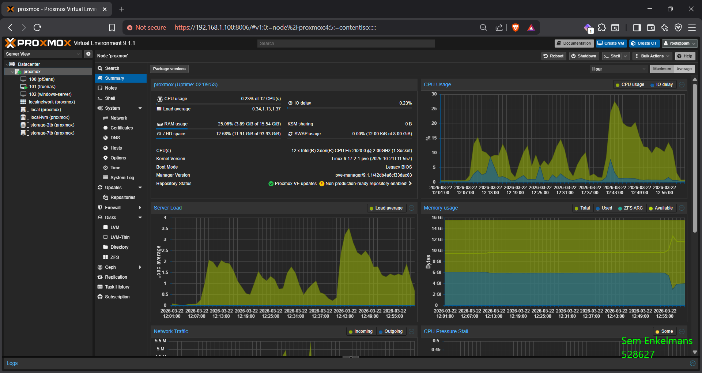
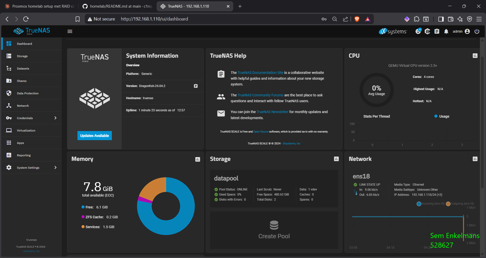
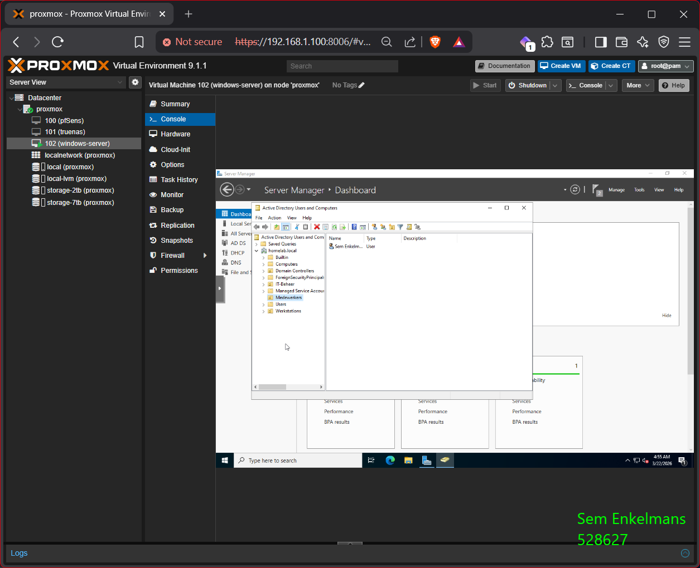
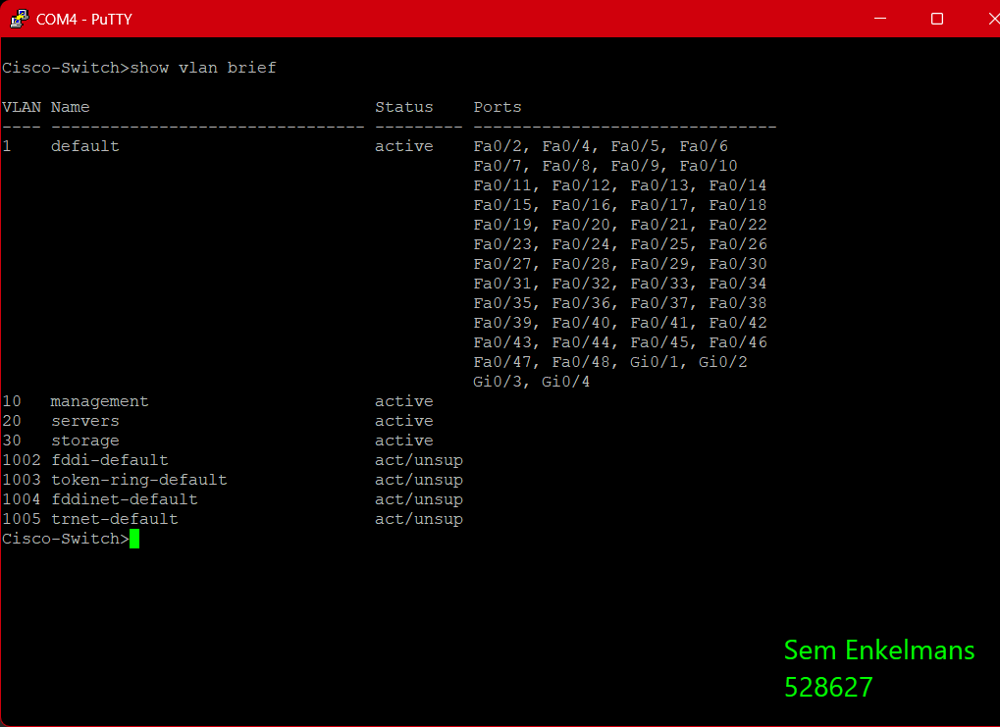

# 🖥️ Homelab — Proxmox VE op Enterprise Hardware


> **Vista College — Niveau 4 System Engineer**  
> Homelab opgebouwd op een Intel enterprise rack server met RAID storage, VLAN segmentatie, pfSense firewall, TrueNAS NAS, Windows Server 2022 met Active Directory, Ubuntu Server met Docker/Ansible/Grafana/Wazuh SIEM en Proxmox VE als hypervisor.

---

## 📸 Screenshots

| Proxmox | TrueNAS |
|---------|---------|
|  |  |

| Active Directory | Cisco Switch |
|-----------------|--------------|
|  |  |

---

## 📦 Hardware

| Component | Model |
|-----------|-------|
| 🖥️ Server | Intel R2312IP4LHPC (Nemko R2000 chassis) |
| 🔌 Moederbord | Intel S2600IP dual-socket (1x CPU) |
| 🧠 RAM | 64GB DDR3 ECC Registered |
| 💾 RAID controller | Broadcom/LSI MegaRAID SAS 2208 |
| 🔀 Switch | Cisco Catalyst 3560 48-port FastEthernet |
| 🌐 Router | Netgear (192.168.1.254) |

---

## 💾 Schijfopstelling

| Slot | Grootte | RAID Array | Status |
|------|---------|------------|--------|
| 0 | 2.728 TB | RAID-6 — VD1 | ✅ Online |
| 1 | 2.728 TB | RAID-6 — VD1 | ✅ Online |
| 2 | 2.728 TB | RAID-6 — VD1 | ✅ Online |
| 3 | 931 GB | RAID-1 — VD0 | ✅ Online |
| 4 | 931 GB | RAID-1 — VD0 | ✅ Online |
| 5 | 2.728 TB | — | ⏳ Unconfigured |
| 6 | 1.819 TB | RAID-6 — VD2 | ✅ Online |
| 7 | 1.819 TB | RAID-6 — VD2 | ✅ Online |
| 8 | 1.819 TB | RAID-6 — VD2 | ✅ Online |
| 9 | 1.819 TB | RAID-6 — VD2 | ✅ Online |
| 10 | 1.819 TB | RAID-6 — VD2 | ✅ Online |
| 11 | 1.819 TB | RAID-6 — VD2 | ✅ Online |

---

## 🌐 Netwerk
```
Internet
    │
    ▼
Netgear Router ── 192.168.1.254
    │
    ▼
Cisco Catalyst 3560 ── 192.168.1.2
    ├── Fa0/1 ──► Proxmox Server   (trunk: VLAN 1, 10, 20, 30)
    ├── Fa0/2 ──► Laptop
    └── Fa0/3 ──► Netgear Router   (trunk: VLAN 1, 10, 20, 30)
```

### VLAN Schema

| VLAN | Naam | Subnet | Doel |
|------|------|--------|------|
| 1 | default | 192.168.1.0/24 | Beheer / bestaand netwerk |
| 10 | management | 192.168.10.0/24 | Proxmox beheer |
| 20 | servers | 192.168.20.0/24 | Virtuele machines |
| 30 | storage | 192.168.30.0/24 | NAS / backup |

### VM / Service IP-schema

| Host | IP | Functie |
|------|----|---------|
| Proxmox | 192.168.1.100 | Hypervisor |
| pfSense WAN | 192.168.1.101 | Firewall beheer |
| pfSense LAN | 192.168.20.1 | Gateway VLAN 20 |
| TrueNAS | 192.168.1.110 | NAS / SMB share |
| Windows Server | 192.168.1.102 | AD, DNS, DHCP |
| Ubuntu Server | 192.168.1.103 | Docker, Ansible, Grafana, Wazuh |
| Cisco switch | 192.168.1.2 | Netwerk beheer |

---

## ⚙️ Configuratie

### Proxmox — `/etc/network/interfaces`
```bash
auto vmbr0
iface vmbr0 inet static
        address 192.168.1.100/24
        gateway 192.168.1.254
        bridge-ports nic0
        bridge-stp off
        bridge-fd 0

auto vmbr0.10
iface vmbr0.10 inet static
        address 192.168.10.1/24

auto vmbr0.20
iface vmbr0.20 inet static
        address 192.168.20.1/24

auto vmbr0.30
iface vmbr0.30 inet static
        address 192.168.30.1/24
```

---

### MegaCLI — Schijven zichtbaar maken
```bash
wget http://ftp.debian.org/debian/pool/main/n/ncurses/libtinfo5_6.4-4_amd64.deb
wget http://ftp.debian.org/debian/pool/main/n/ncurses/libncurses5_6.4-4_amd64.deb
dpkg -i libtinfo5_6.4-4_amd64.deb
dpkg -i libncurses5_6.4-4_amd64.deb

/opt/MegaRAID/MegaCli/MegaCli64 -PDList -aALL | grep -E "Slot Number|Raw Size|Firmware state"
/opt/MegaRAID/MegaCli/MegaCli64 -LDInfo -Lall -aALL
```

---

### Storage — Mounten in Proxmox
```bash
mkfs.ext4 /dev/sdb
mkfs.ext4 /dev/sdc
mkdir -p /mnt/storage-2tb
mkdir -p /mnt/storage-7tb
echo "UUID=$(blkid -s UUID -o value /dev/sdb)  /mnt/storage-2tb  ext4  defaults  0  2" >> /etc/fstab
echo "UUID=$(blkid -s UUID -o value /dev/sdc)  /mnt/storage-7tb  ext4  defaults  0  2" >> /etc/fstab
systemctl daemon-reload && mount -a
```

---

### Cisco Catalyst 3560 — VLANs & Trunks
```
conf t
vlan 10
 name management
vlan 20
 name servers
vlan 30
 name storage
interface Fa0/1
 switchport trunk encapsulation dot1q
 switchport mode trunk
 switchport trunk allowed vlan 1,10,20,30
interface Fa0/3
 switchport trunk encapsulation dot1q
 switchport mode trunk
 switchport trunk allowed vlan 1,10,20,30
end
write memory
```

SSH verbinden vanaf Windows met IOS 12.2:
```bash
ssh -oKexAlgorithms=+diffie-hellman-group1-sha1 \
    -oHostKeyAlgorithms=+ssh-rsa \
    -oCiphers=+aes256-cbc \
    -oMACs=+hmac-sha1 \
    admin@192.168.1.2
```

---

### pfSense — Firewall VM

| Instelling | Waarde |
|-----------|--------|
| VM ID | 100 |
| CPU | 2 cores |
| RAM | 2048 MB |
| Disk | 20 GB |
| WAN | 192.168.1.101 |
| LAN | 192.168.20.1 |
| Webinterface | http://192.168.1.101 |
| Versie | pfSense CE 2.6.0 |

---

### TrueNAS SCALE — NAS VM

| Instelling | Waarde |
|-----------|--------|
| VM ID | 101 |
| CPU | 4 cores |
| RAM | 8192 MB |
| Boot disk | 50 GB |
| Data disks | 2x 500 GB Mirror (ZFS) |
| IP | 192.168.1.110 |
| Webinterface | http://192.168.1.110 |
| SMB share | \\192.168.1.110\data |

---

### Windows Server 2022 — AD/DNS/DHCP VM

| Instelling | Waarde |
|-----------|--------|
| VM ID | 102 |
| CPU | 4 cores |
| RAM | 4096 MB |
| Disk | 60 GB |
| IP | 192.168.1.102 |
| Domein | homelab.local |

**Active Directory:**
- OUs: `Medewerkers`, `Werkstations`, `IT-Beheer`
- Gebruiker: `s.enkelmans@homelab.local`

**DHCP scope:** `192.168.1.150 — 192.168.1.200`

---

### Ubuntu Server — Docker/Ansible/Monitoring VM

| Instelling | Waarde |
|-----------|--------|
| VM ID | 103 |
| CPU | 4 cores |
| RAM | 4096 MB |
| Disk | 40 GB |
| IP | 192.168.1.103 |
| OS | Ubuntu 24.04 LTS |

**Draaiende services:**

| Service | Poort | Beschrijving |
|---------|-------|--------------|
| Portainer | 9000 | Docker beheer GUI |
| Prometheus | 9090 | Metrics collectie |
| Grafana | 3000 | Monitoring dashboard |
| Node Exporter | 9100 | Server metrics |
| Wazuh Manager | 443 | SIEM dashboard |
| Wazuh Indexer | 9200 | Log opslag |

**Wazuh agents:**
| Agent | IP | OS | Status |
|-------|----|----|--------|
| ubuntu-server | 192.168.1.103 | Ubuntu 24.04 | ✅ Active |
| windows-server | 192.168.1.102 | Windows Server 2022 | ✅ Active |

---

## ✅ Voortgang

- [x] Proxmox VE 9.1.1 geïnstalleerd
- [x] Repository geconfigureerd (no-subscription)
- [x] MegaCLI64 werkend — alle 12 schijven zichtbaar
- [x] RAID arrays geïdentificeerd (RAID-1 + 2x RAID-6)
- [x] 2.7 TB + 7.3 TB storage gemount en toegevoegd aan Proxmox
- [x] Cisco 3560 geconfigureerd met VLAN 10 / 20 / 30
- [x] Trunk poorten actief op Fa0/1 en Fa0/3
- [x] SSH toegang op Cisco switch
- [x] Proxmox VLAN interfaces actief
- [x] pfSense VM geïnstalleerd en geconfigureerd
- [x] TrueNAS SCALE VM met ZFS Mirror pool
- [x] SMB share actief en bereikbaar vanaf Windows
- [x] Windows Server 2022 met AD, DNS, DHCP
- [x] Ubuntu Server met Docker + Ansible
- [x] Portainer dashboard
- [x] Grafana + Prometheus + Node Exporter
- [x] Wazuh SIEM met 2 actieve agents
- [ ] Kali Linux VM
- [ ] WireGuard VPN
- [ ] Gitea + CI/CD pipeline

---

*Vista College — Niveau 4 System Engineer | 2026*
